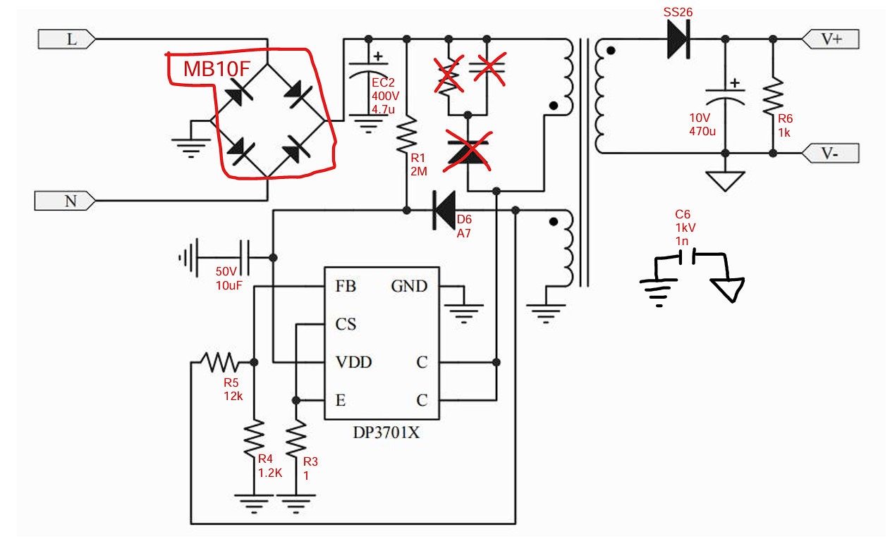

# electronics-is-dead
This is a reminder for myself how easy to produce a lot of common electronics with knowledge all over the place 
and local companies become just distributors. Everyone just produce a part of machines and it is impossible
to produce something from sctrach and compete. Just buy and sell, you don't even need to give service.
In some time buy and sell won't be profitable I guess and(or) Global companies will establish their own 
production or service or both locally in each country. And, most of them already do.

Old Door Bell

youtube link

Generic Fan

